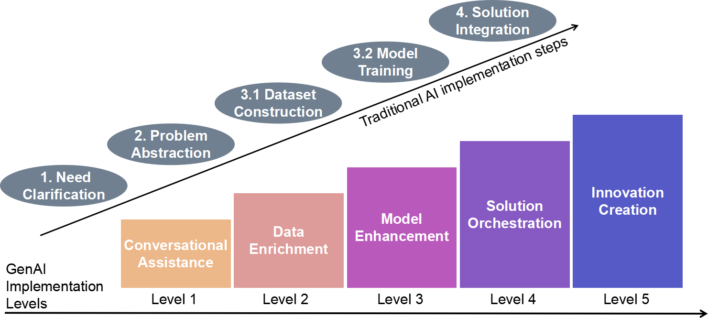

# GenAI_in_manufacturing
This is the repository for the paper "Generative AI for future manufacturing".

[](https://opensource.org/licenses/MIT)  

This repository accompanies the paper **"Generative AI for future manufacturing"** (under review). It serves as a living resource for tracking advancements in GenAI for manufacturing.  

---

## 📖 Overview  
This work provides:  
1. A **systematic literature review** of 107 studies (2022–2025) on GenAI in manufacturing to establish a foundation for understanding GenAI's role in manufacturing.  
2. A **5-level taxonomy** categorizing GenAI integration depth (from Conversational Assistance to Innovation Creation) to discuss rencent advancements, limitations and future endeavours of GenAI in manufacturing.  
3. A **GenAI-Driven Manufacturing Paradigm** to depict our envision for future manufacturing and spark interdisciplinary debate on this emergent topic.  

  
*Figure:  The five levels of GenAI implementation in manufacturing (from the paper).*

---

## 🔍 Recent Advancements (Under Construction)  
### Research Articles
| Date       | Paper Title | Summary | Link |  
|------------|-------------|---------|------|  
| 2024-03-15 | *"LLM-Driven Robotic Assembly Line Optimization"* | Uses GPT-4 for real-time scheduling in automotive plants. | [arXiv](link) |  

### Non-Research Articles
| Date       | Paper Title | Summary | Link |  
|------------|-------------|---------|------|  
| 2024 | *"Generative AI-enabled supply chain management: The critical role of coordination and dynamism"* | International Journal of Production Economics | [DOI](https://doi.org/10.1016/j.ijpe.2024.109388) |  


---

## ✍️ Citation  
If you use this work, please cite:  
```bibtex  
@article{zheng2025genai4manufacturing,  
  title={Generative AI for future manufacturing},  
  author={Hao Zheng, Ziyue Geng, Xun Xu},  
  year={2025},  
}
